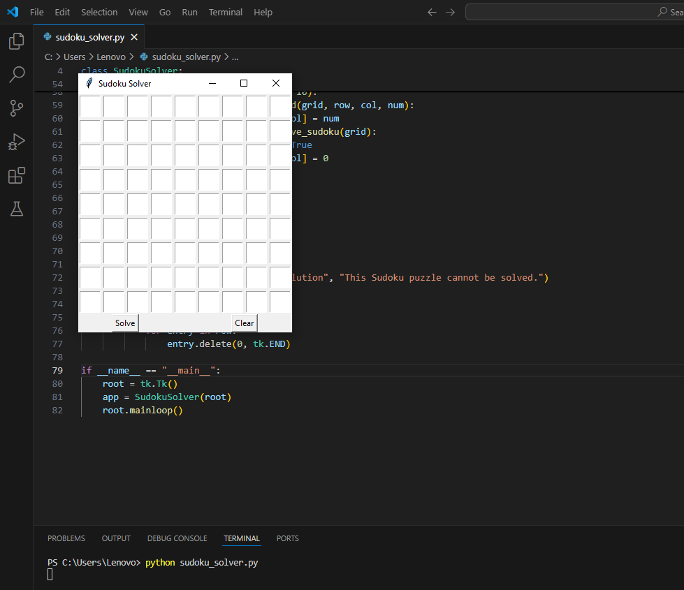
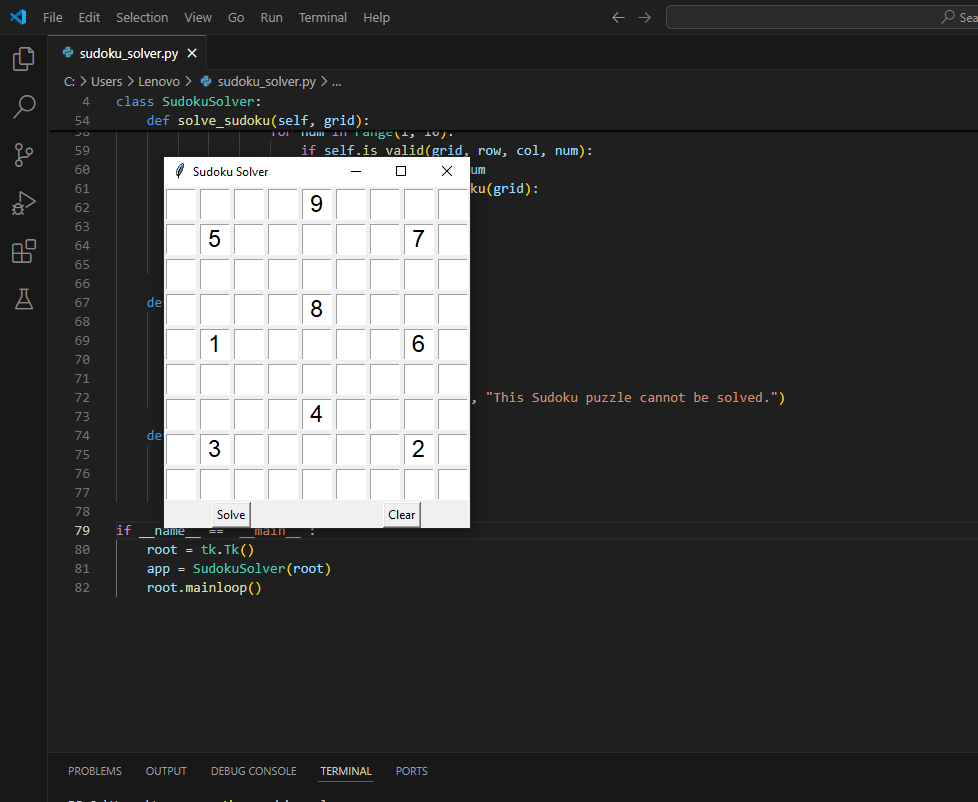
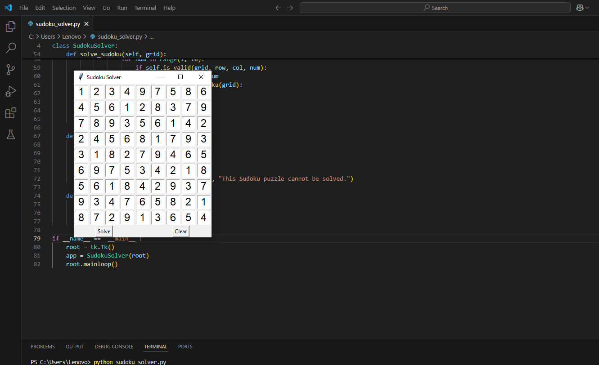

# Sudoku Solver - Prodigy Infotech Internship (Task 04)

## 🔍 Task Objective

Create a program that solves Sudoku puzzles automatically using an algorithm like *backtracking*. It should:

- Take input from the user via GUI.
- Automatically solve the puzzle.
- Display the solved puzzle in the same grid.

## 💡 Features

- GUI interface using Tkinter.
- Solves standard 9x9 Sudoku puzzles.
- Uses backtracking to fill the missing numbers.
- Error handling for unsolvable puzzles.
- Clear button to reset the board.

## 🛠️ Technologies Used

- Python 3.x
- Tkinter for GUI

## 📷 Screenshots
### Output of the code


### Taking some values


### Fully solved sudoku


## ▶️ How to Run

1. Clone this repo:
  ```bash
   python sudoku_solver.py
  
